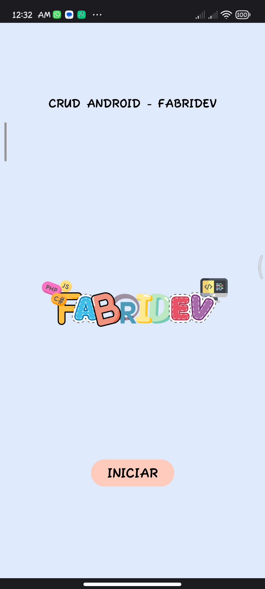
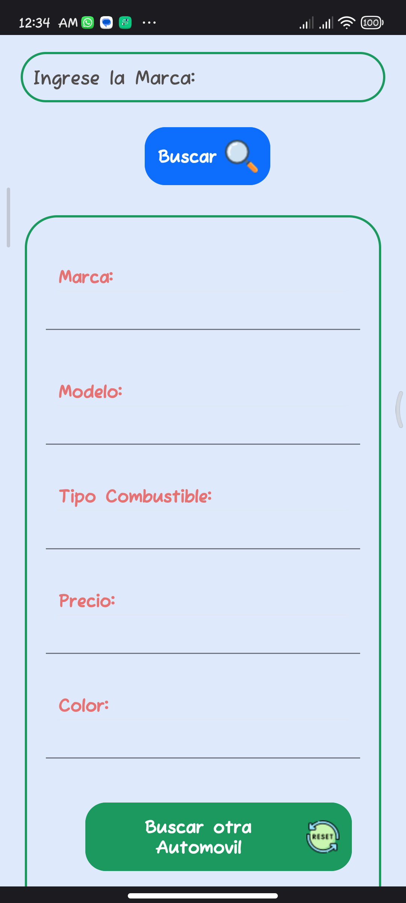
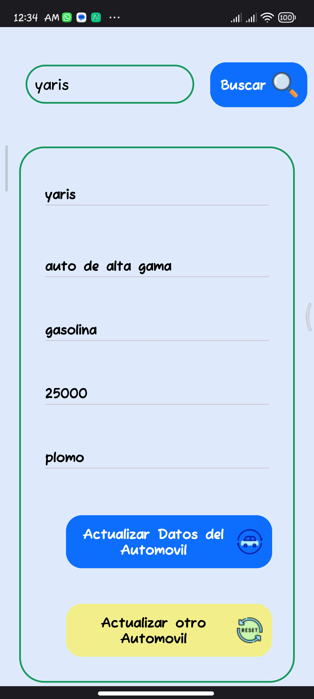
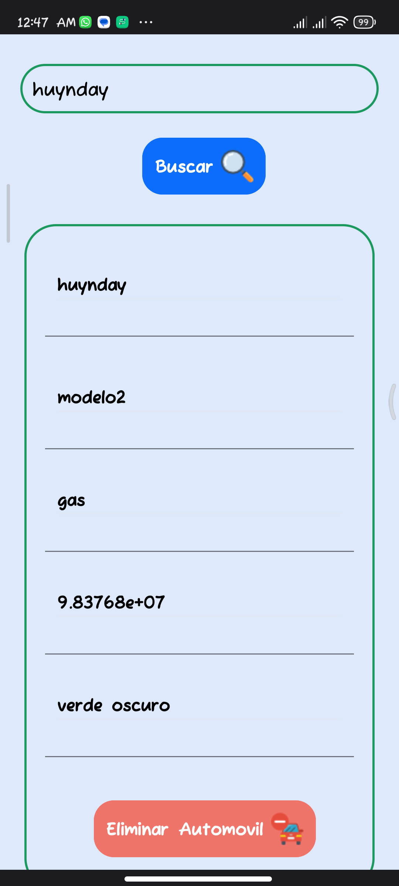
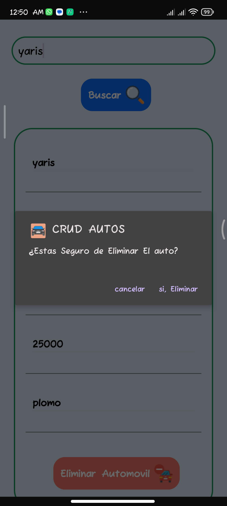
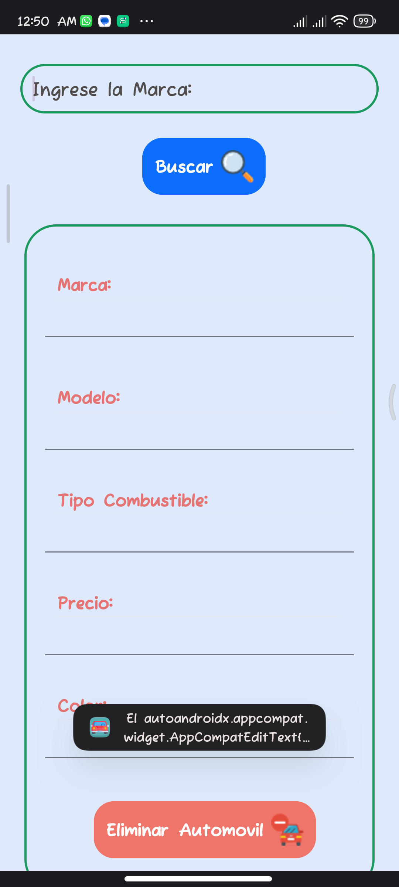
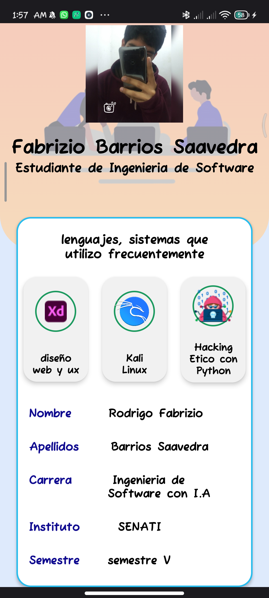

<h4>CRUD AUTOMOVIL con JAVA</h4>
<h4>Lenguajes Utilizados:</h4>

<h4 class="py-3">JAVA</h4>
<h4 class="py-3">SQLite</h4>
<h4 class="py-3">FLATICON</h4>
 

<h4 class="py-3">por el momento esta en mantenimiento ;)</h4>
Pero Puedes Visualizarlo en las siguientes imagenes:
<h3 class="py-4">Parte principal</h3>

<h3 class="py-4">Parte Opciones</h3>

<h3 class="py-4">Parte Registro</h3>

<h3 class="py-4">Parte Buscar</h3>

<h3 class="py-4">Parte Actualizar</h3>

<h3 class="py-4">Parte Eliminar</h3>

<h3 class="py-4">Parte Informacion</h3>

<h4>Para una mejor Experiencia descarga el APK 📱 pronto lo podras ven el la play store ;) </h4>
<a href="https://www.mediafire.com/file/fos4dw810de92qc/crud-senati.apk/file" class="btn btn-outline-success fa-solid fa-download"  title="descargar el proyecto">descargar</a>

<h3 class="py-4"><b>Realizado por:</b> Fabrizio Barrios Saavedra (RFBS19 - fabridev)</h3>

